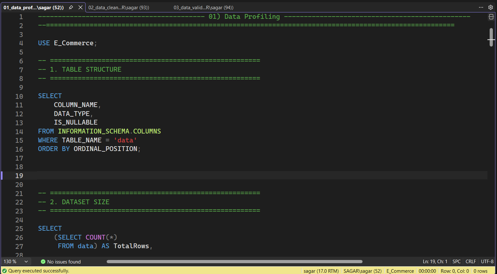
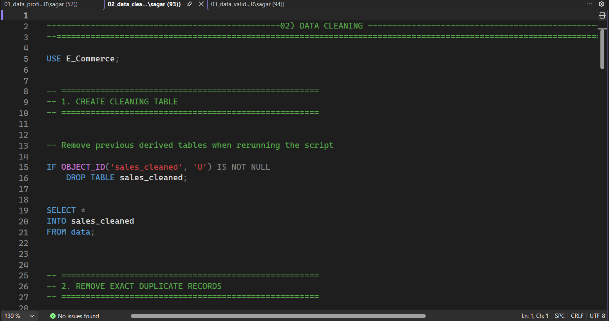
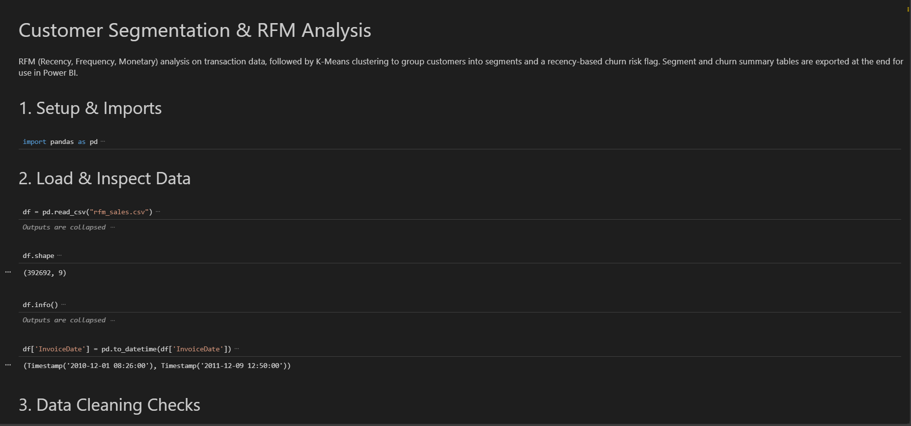
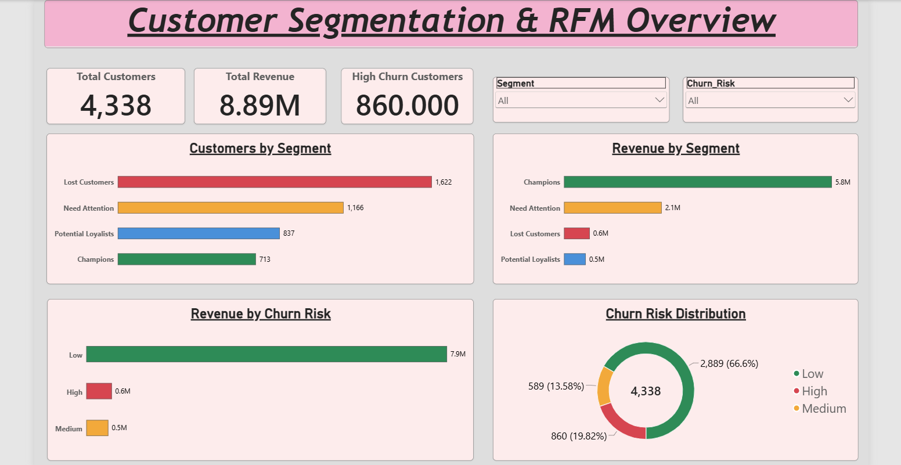
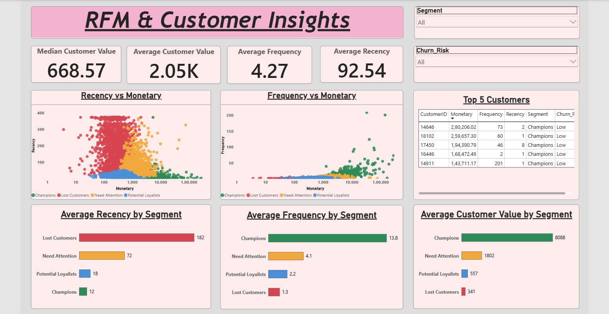
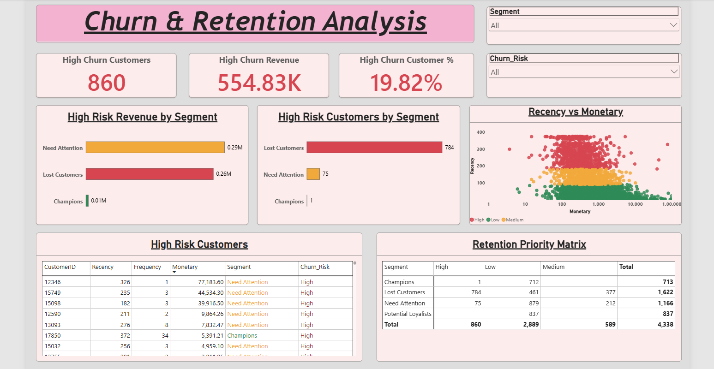

<div align="center">

# Customer Segmentation & RFM Analytics

<p><b>End-to-End Analytics Pipeline: SQL Data Engineering, RFM Modeling & Power BI Dashboards</b></p>

<p>
  <a href="https://www.python.org/"></a>
  <a href="https://www.microsoft.com/sql-server"></a>
  <a href="https://powerbi.microsoft.com/"></a>
  <a href="https://pandas.pydata.org/"></a>
  <a href="https://scikit-learn.org/"></a>
</p>

<p>
  <a href="#executive-summary">Executive Summary</a> &bull;
  <a href="#key-project-metrics">Key Metrics</a> &bull;
  <a href="#pipeline-architecture">Architecture</a> &bull;
  <a href="#data-preparation--sql-pipeline">SQL Pipeline</a> &bull;
  <a href="#rfm-analysis--customer-segmentation">RFM Modeling</a> &bull;
  <a href="#customer-segment-profiles">Segments</a> &bull;
  <a href="#power-bi-dashboard-suite">Dashboards</a> &bull;
  <a href="#reproduction--execution-guide">Setup Guide</a>
</p>

</div>

---

## Executive Summary

Retail and e-commerce organizations frequently encounter diminished marketing efficiency when deploying broad, uniform customer campaigns. Without behavioral segmentation, marketing budgets are misallocated, high-spending accounts risk neglect, and early indicators of customer churn remain undetected.

This project delivers an end-to-end data analytics workflow that evaluates customer purchasing patterns across **Recency, Frequency, and Monetary (RFM)** dimensions:
* **Ingested and profiled 541,909 raw transaction records**, isolating anomalies, cancellations, and missing keys to produce **392,692 validated, customer-attributable sales rows** in SQL Server.
* **Segmented 4,338 active accounts** across **£8.89M in total verified revenue** into four distinct behavioral cohorts via RFM quintile scoring and standardized K-Means clustering.
* **Quantified the revenue concentration:** The top cohort (**Champions**, 16.4% of total customer accounts) generates **64.9% of total revenue (£5.77M)** with an average customer spend of **£8,088.02**.
* **Diagnosed £554.83K in churn exposure** across 860 dormant accounts, identifying **75 high-value accounts in the "Need Attention" tier** representing **over £290,000 in at-risk revenue**.

---

## Key Project Metrics

| Category | Metric | Value | Analytical Detail |
| :--- | :--- | ---: | :--- |
| **Transaction Scale** | Raw Ingested Records | 541,909 | Comprehensive annual retail transaction dataset |
| **Data Hygiene** | Validated Sales Records | 392,692 | Verified customer-linked sales (`Quantity > 0`, `UnitPrice > 0`) |
| **Customer Scale** | Unique Analyzed Customers | 4,338 | Deduplicated active customer accounts |
| **Financial Scale** | Total Attributable Spend | £8,887,208.84 | Sum of verified customer purchase revenue |
| **Order Economics** | Unique Invoices | 18,532 | Total unique purchasing transactions |
| **Order Economics** | Average Orders per Customer | 4.27 | Mean purchase frequency across the customer base |
| **Value Distribution** | Median vs. Mean Spend | £668.57 / £2,048.69 | Pronounced positive skewness requiring logarithmic treatment |
| **Clustering Quality** | Optimal K Clusters | K = 4 | Determined via Elbow Method (Inertia) and Silhouette Score |
| **Clustering Quality** | Silhouette Score & Inertia | 0.338 / 3,939.05 | Maximum cluster interpretability on standard-scaled log RFM |
| **Retention Risk** | High Churn Risk Revenue | £554,833.00 | Total spend tied to accounts dormant >180 days |

---

## Technical Stack

* **Data Engineering & Querying:** Microsoft SQL Server (T-SQL), SQL Server Management Studio (SSMS), Common Table Expressions (CTEs), Window Functions (`ROW_NUMBER() OVER PARTITION BY`), Data Profiling, Schema Validation.
* **Statistical Analysis & Processing:** Python 3.9+, Pandas, NumPy, Logarithmic Transformations (`np.log1p`), Skewness and Outlier Inspection.
* **Clustering & Unsupervised Learning:** Scikit-Learn (`KMeans`, `StandardScaler`, `silhouette_score`), RFM Quintile Scoring (`pd.qcut`).
* **Business Intelligence & Reporting:** Microsoft Power BI Desktop, DAX Measures, Semantic Modeling, Interactive Cross-Filtering, Custom Slicers, Scatter Plots.

---

## Pipeline Architecture

```
Raw Data (541K Rows) ──► T-SQL Data Cleaning ──► Validated Sales (392K Rows) ──► Python RFM & K-Means ──► Power BI Dashboards
```

| Stage | Focus Area | Technology | Core Deliverables & Logic |
| :--- | :--- | :--- | :--- |
| **1. Data Profiling & Cleaning** | Data Hygiene & Anomaly Audits | Microsoft SQL Server (T-SQL) | Ingested 541K records; isolated missing `CustomerID`s (24.9%); removed cancellations (`C%`) and non-positive prices; eliminated duplicate rows via `ROW_NUMBER()`. |
| **2. Integrity Validation** | Data Quality Assertions | Microsoft SQL Server (T-SQL) | Reconciled row counts and verified row-level mathematical integrity (`TotalAmount = Quantity * UnitPrice`), finalizing 392,692 verified sales rows across 4,338 unique customers. |
| **3. Statistical Segmentation** | Feature Engineering & Clustering | Python (Pandas, Scikit-Learn) | Computed individual RFM metrics; normalized skewed distributions using `log1p`; standardized features (`StandardScaler`); evaluated $K=2$ to $10$ to select $K=4$ clusters. |
| **4. Churn Risk Stratification** | Customer Retention Matrix | Python (Pandas) | Classified accounts into Low ($\le$90d), Medium (91-180d), and High (>180d) churn risk tiers; constructed the 2D Retention Priority Matrix across customer segments. |
| **5. Executive BI Reporting** | Interactive Decision Support | Microsoft Power BI | Engineered a 3-page interactive reporting suite featuring DAX KPIs, whale account tracking, dynamic slicers, and revenue-at-risk visual drill-downs. |

---

## Data Preparation & SQL Pipeline

The raw retail dataset contained transactional anomalies, unassigned customer IDs, cancellations, and duplicate rows. The engineering workflow is implemented across three sequential T-SQL scripts in `sql_scripts/`.

### 1. Data Profiling (`01_data_profiling.sql`)
* **Missing Identifiers:** 135,080 rows (24.93%) lacked `CustomerID` values (guest checkouts). These transactions were separated because RFM analysis requires individual account histories.
* **Cancellations & Adjustments:** Invoices prefixed with `C` and records with negative quantities represented return merchandise or inventory reconciliations.
* **Pricing Outliers:** Non-positive unit prices (`UnitPrice <= 0`) were identified and flagged for exclusion.

### 2. Data Cleaning (`02_data_cleaning.sql`)
Exact duplicate transaction records were eliminated using a Common Table Expression (CTE) and the `ROW_NUMBER()` window function:

```sql
WITH DuplicateRecords AS (
    SELECT
        *,
        ROW_NUMBER() OVER (
            PARTITION BY InvoiceNo, StockCode, Description, 
                         Quantity, InvoiceDate, UnitPrice, CustomerID, Country
            ORDER BY (SELECT NULL)
        ) AS RowNum
    FROM sales_cleaned
)
DELETE FROM DuplicateRecords
WHERE RowNum > 1;
```

Transactions were subsequently filtered to retain only valid revenue-generating sales:
* `CustomerID IS NOT NULL`
* `Quantity > 0`
* `UnitPrice > 0`
* `TotalAmount = Quantity * UnitPrice`

### 3. Data Validation (`03_data_validation.sql`)
A dedicated validation script reconciled row counts and executed data integrity assertions:
* Confirmed **0** null customer IDs in the final sales table.
* Confirmed **0** non-positive quantities or unit prices.
* Confirmed **0** discrepancies between `TotalAmount` and `Quantity * UnitPrice`.
* Final analytical dataset reconciliation: **392,692 rows**, **4,338 customers**, **£8,887,208.84 total spend**.

<p align="center">
  
  
</p>

---

## RFM Analysis & Customer Segmentation

The statistical analysis, skewness treatment, and unsupervised clustering pipeline is developed in `python_notebook/customer_rfm_analysis.ipynb`.

### 1. Metric Calculation
Using an analysis reference date of `2011-12-10` (one day after the latest recorded transaction):
* **Recency ($R$):** Days elapsed since the customer's last purchase.
* **Frequency ($F$):** Total count of unique order invoices per customer.
* **Monetary ($M$):** Cumulative spending across all valid transactions.

Additionally, RFM scores (1 to 5) were generated via quintile discretization (`pd.qcut`), providing an aggregate RFM score from 3 to 15.

### 2. Distribution Skewness & Normalization
E-commerce transactional data typically displays pronounced positive skewness and long tails. Unadjusted outliers in order frequency and spend distort distance-based clustering algorithms:

| Metric | Raw Skewness | Skewness After `log1p` | Analytical Effect |
| :--- | :---: | :---: | :--- |
| **Recency** | `+1.25` | **`-0.38`** | Balanced distribution across recency windows |
| **Frequency** | `+12.07` | **`+1.21`** | Significant reduction in extreme purchase count pull |
| **Monetary** | `+19.34` | **`+0.40`** | Transformed heavy monetary tail into near-Gaussian curve |

Features were then standardized using `StandardScaler` (mean = 0, standard deviation = 1) to ensure equal feature weighting.

<p align="center">
  
</p>

### 3. Cluster Model Selection
Candidate cluster solutions were tested from $K = 2$ to $K = 10$ using the Elbow Method (Inertia) and Silhouette Scores:

* **K = 2:** Silhouette = 0.433 | Inertia = 6,483.59. Only separates active from inactive accounts; lacks strategic granularity.
* **K = 3:** Silhouette = 0.337 | Inertia = 4,869.49. Combines moderate and high-frequency buyers into a single broad tier.
* **K = 4:** Silhouette = **0.338** | Inertia = **3,939.05**. Chosen optimal solution: provides a clear elbow drop and establishes four actionable behavioral tiers.

---

## Customer Segment Profiles

The four clusters were mapped into distinct operational customer segments:

| Segment | Customers | % Share | Total Revenue | % Revenue | Avg Recency | Avg Frequency | Avg Spend |
| :--- | ---: | ---: | ---: | ---: | ---: | ---: | ---: |
| **Champions** | **713** | 16.44% | **£5,766,757.27** | **64.89%** | 12.2 days | 13.75 orders | £8,088.02 |
| **Need Attention** | **1,166** | 26.88% | **£2,100,873.34** | **23.64%** | 71.6 days | 4.08 orders | £1,801.78 |
| **Potential Loyalists** | **837** | 19.29% | **£466,479.03** | **5.25%** | 17.7 days | 2.19 orders | £557.32 |
| **Lost Customers** | **1,622** | 37.39% | **£553,099.19** | **6.22%** | 181.5 days | 1.32 orders | £341.00 |
| **Total / Overall** | **4,338** | **100.00%** | **£8,887,208.84** | **100.00%** | **92.5 days** | **4.27 orders** | **£2,048.69** |

### Key Behavioral Observations:
* **Pareto Concentration:** 16.4% of customer accounts (Champions) generate 64.9% of total company revenue, confirming high revenue concentration in top-tier accounts.
* **The "Need Attention" Opportunity:** Accounts for 23.6% of revenue (£2.10M) with an average spend of £1,801.78, but an average recency of 71.6 days. This cohort represents the primary target for retention campaigns.
* **Lapsed Accounts:** 37.4% of the customer base has lapsed (average recency 181.5 days) and contributed only 6.2% of historical revenue.

---

## Churn Risk & Retention Matrix

Customer churn risk was classified based on transaction recency:
* **Low Risk ($\le 90$ days):** Actively purchasing within the last quarter.
* **Medium Risk ($91 - 180$ days):** Decreased velocity; early warning window.
* **High Risk ($> 180$ days):** Inactive for over six months; severe lapse risk.

### Churn Risk Breakdown

| Risk Tier | Customers | % Share | Total Revenue | % Revenue | Avg Recency | Avg Frequency | Avg Spend |
| :--- | ---: | ---: | ---: | ---: | ---: | ---: | ---: |
| **Low Risk** | 2,889 | 66.60% | £7,854,666.52 | 88.38% | 31.8 days | 5.48 | £2,718.82 |
| **Medium Risk** | 589 | 13.58% | £477,709.32 | 5.38% | 132.6 days | 2.37 | £811.05 |
| **High Risk** | **860** | **19.82%** | **£554,833.00** | **6.24%** | **269.1 days** | **1.50** | **£645.15** |

### Retention Priority Cross-Matrix

| Segment | High Risk (>180d) | Medium Risk (91-180d) | Low Risk (<=90d) | Total Customers |
| :--- | ---: | ---: | ---: | ---: |
| **Champions** | 1 | 0 | 712 | **713** |
| **Need Attention** | **75** | **212** | 879 | **1,166** |
| **Potential Loyalists** | 0 | 0 | 837 | **837** |
| **Lost Customers** | 784 | 377 | 461 | **1,622** |
| **Total** | **860** | **589** | **2,889** | **4,338** |

> [!IMPORTANT]
> **Priority Retention Finding:** While 784 high-risk accounts belong to the low-spending "Lost Customers" segment, **75 accounts in the "Need Attention" segment have crossed into the High Churn Risk category**. These 75 customers represent **over £290,000 in past revenue** (including Customer `12346` at £77.2K and Customer `15749` at £44.5K). Re-engaging these high-value accounts provides significantly higher return on retention spend than mass outreach to one-time buyers.

---

## Power BI Dashboard Suite

The interactive dashboard (`power_bi/customer_segmentation_rfm.pbix`) is organized into three analytical views:

### Page 1: Customer Segmentation & RFM Overview
* Summary KPI cards for Total Customers (4,338), Total Revenue (£8.89M), and High Churn Accounts (860).
* Segment comparison: Customer account volume versus revenue generation.
* Donut visual for Churn Risk distribution and dynamic slicers for ad-hoc filtering.

<p align="center">
  
</p>

---

### Page 2: RFM & Customer Insights
* Central tendency metrics: Median spend (£668.57) versus average spend (£2.05K).
* Dual scatter plots: Recency vs. Monetary and Frequency vs. Monetary with segment color coding.
* Leaderboard tracking top high-value accounts (e.g., Customer `14646` at £280.2K spend).

<p align="center">
  
</p>

---

### Page 3: Churn & Retention Analysis
* Quantification of high-risk revenue (£554.83K) and dormant account count (860).
* Segment-by-segment churn distribution isolating at-risk revenue within the "Need Attention" cohort.
* Full Retention Priority Matrix table for operational campaign targeting.

<p align="center">
  
</p>

---

## Strategic Recommendations

| Segment | Primary Objective | Tactical Action Plan | Recommended Channel |
| :--- | :--- | :--- | :--- |
| **Champions** | Retention & Lifetime Value | Enroll in dedicated VIP account management; provide early access to new product catalog drops; protect margins by avoiding generic coupon discounting. | Dedicated Account Manager / Personalized Email |
| **Need Attention** | Churn Prevention | Trigger automated win-back email workflows for accounts dormant >60 days; offer category-relevant incentives; conduct direct sales outreach for top spenders (>£5K historical). | Lifecycle Email / Direct Outbound Call |
| **Potential Loyalists** | Basket Size & Order Cadence | Deploy cross-sell product recommendations based on initial purchases; use minimum-spend free shipping thresholds to increase Average Order Value (AOV). | Category Newsletters / In-App Messaging |
| **Lost Customers** | Low-Cost Reactivation | Run clearance or seasonal liquidation campaigns; gather exit feedback via short surveys; suppress chronic non-responders to minimize marketing overhead. | Automated Email Cadence |

---

## Project Structure

```text
customer-segmentation-rfm-analytics/
├── dataset/
│   ├── sales_data.csv
│   └── final_rfm_customer_segmentation.csv
├── power_bi/
│   └── customer_segmentation_rfm.pbix
├── python_notebook/
│   └── customer_rfm_analysis.ipynb
├── screenshots/
│   ├── 01_customer_segmentation_overview.png
│   ├── 02_rfm_customer_insights.png
│   ├── 03_churn_retention_analysis.png
│   ├── 04_sql_data_profiling.png
│   ├── 05_sql_cleaning_validation.png
│   └── 06_python_rfm_analysis.png
└── sql_scripts/
    ├── 01_data_profiling.sql
    ├── 02_data_cleaning.sql
    └── 03_data_validation.sql
```

### Component Breakdown

| Directory / File | Component Type | Analytical Purpose |
| :--- | :--- | :--- |
| `dataset/sales_data.csv` | Raw Data | Unprocessed retail transaction records (541,909 rows) |
| `dataset/final_rfm_customer_segmentation.csv` | Clean Data | Customer-level RFM metrics, segment classifications, and churn flags (4,338 rows) |
| `power_bi/customer_segmentation_rfm.pbix` | Power BI Report | 3-page interactive dashboard with DAX measures and custom slicers |
| `python_notebook/customer_rfm_analysis.ipynb` | Jupyter Notebook | Complete Python workflow: EDA, log1p transformation, feature scaling, and K-Means |
| `sql_scripts/01_data_profiling.sql` | T-SQL Script | Database-level profiling for null values, negative quantities, and anomalies |
| `sql_scripts/02_data_cleaning.sql` | T-SQL Script | CTE deduplication using `ROW_NUMBER()` and business rule filters |
| `sql_scripts/03_data_validation.sql` | T-SQL Script | Row count reconciliation and mathematical integrity assertions |
| `screenshots/` | Visual Assets | High-resolution visual documentation of dashboards, SQL queries, and notebooks |

---

## Reproduction & Execution Guide

### 1. Database Setup (SQL Server)
1. Open SQL Server Management Studio (SSMS) and create a database named `E_Commerce`.
2. Import `dataset/sales_data.csv` into a table named `data`.
3. Execute the SQL scripts in sequential order:
   * `sql_scripts/01_data_profiling.sql`
   * `sql_scripts/02_data_cleaning.sql`
   * `sql_scripts/03_data_validation.sql`

### 2. Python Environment & Modeling
1. Clone the repository:
   ```bash
   git clone https://github.com/sagar-bairwa/customer-segmentation-rfm-analytics.git
   cd customer-segmentation-rfm-analytics
   ```
2. Install dependencies:
   ```bash
   pip install pandas numpy scikit-learn matplotlib seaborn
   ```
3. Open and run the Jupyter Notebook:
   ```bash
   jupyter notebook python_notebook/customer_rfm_analysis.ipynb
   ```

### 3. Power BI Dashboard
1. Open `power_bi/customer_segmentation_rfm.pbix` in Power BI Desktop.
2. If prompted, verify the data source connection points to `dataset/final_rfm_customer_segmentation.csv`.
3. Interact with the multi-page executive report.

---

<div align="center">

### Author & Contact

**Sagar Bairwa**  
B.Tech in Computer Science Engineering | Central University of Haryana  
Data Analytics, SQL, Python & Power BI

[](https://linkedin.com/in/sagar-bairwa)
[](https://github.com/sagar-bairwa)
[](mailto:sagar.bairwa.tech@gmail.com)

</div>
